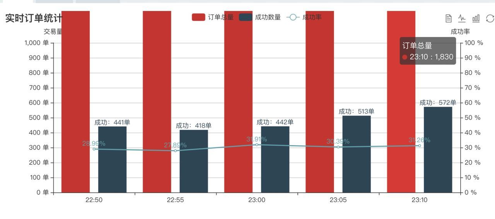

四方聚合支付是一款基于Fastadmin的聚合支付系统，主要使用技术栈：THINPHP5 + VUE + Require.js + Redis + Mysql
5分钟轻松承载1800单   

+
### 只租用，不卖源码。完全自主更新维护。
飞机电报 https://t.me/qinghe845

###  **更新日志** 

2023-07-23 更新测试通道本地拉单全部走本地100%测试成功对接不再依靠外部通道  
2023-07-17 更新订单显示方式 新增通道  
2023-07-14 重大升级：新增拉单测试直接产生新订单，新增20个通道，新增一健绑定机器人  
2023-06-20 机器人升级后台直接添加api，在线查看机器人状态  
2023-06-14 新增一个通道，修改日志记录格式。  
2023-06-12 完成图文教程  
2023-06-10 机器人get消息转义中文保存到文件方便调试  
2023-06-08 修复删除平台产品会导致上游通道无法显示的BUG  
2023-06-08 新增新建平台产品时自动创建循环规则  
2023-06-06 修复机器人群发超过30个群后会重复发信息问题  
2023-06-04 新增干净数据库，新增一个话费通道 无关乎痛痒的1处更新  
2023-05-18 BOT新增查询通道信息  
2023-05-17 去掉了没有用的平台产品域名字段  
2023-05-07 增加清理订单按钮3个时间段[1周,2周，1月]  
2023-04-11 拉单报错信息和成功信息同步到了订单列表里面  
2023-04-02 升级机器人，自动结算，自动查商户订单。  
2023-03-29 修改机器人功能  
2023-03-26 修改余额操作显示，修复机器人遇到不能处理BUG  
2023-03-25 简化拉单流程，修改订单显示界面的内容，更新文档  
2023-03-23 新增布丁，旭日通道  
2023-03-23 调整订单界面显示，更直观。  
2023-03-23 修复机器人发送图片阻塞BUG，调整订单界面显示，更直观    
2023-03-22 机器人完善通知，新增通道  
2023-03-18 修复机器人本地API调用  

## **主要特性**

* 基于`Auth`验证的权限管理系统
    * 支持无限级父子级权限继承，父级的管理员可任意增删改子级管理员及权限设置
    * 支持单管理员多角色
    * 强大的日志功能
* 安全性
    * 谷歌验证码和短信验证码强制开启
    * 银行卡审核、会员认证
    * 多级过滤机制   
* 完全前后端分离
    * 采用VUE ELEMENTUI 前后端完全分离
* 强大的聚合支付功能
    * 代理分润
    * 多通道轮询
    * 接口检测
    * API代付
    
## **免责声明**
本源码仅供技术学习研究使用,请勿用于非法用途,如产生法律纠纷与本人无关。

请勿将系统用于非法业务,合理学习用于非法业务暂停一切售后服务包括更新。
  
非预期使用带来的任何后果跟本人无关，购买即认同以上原则。
